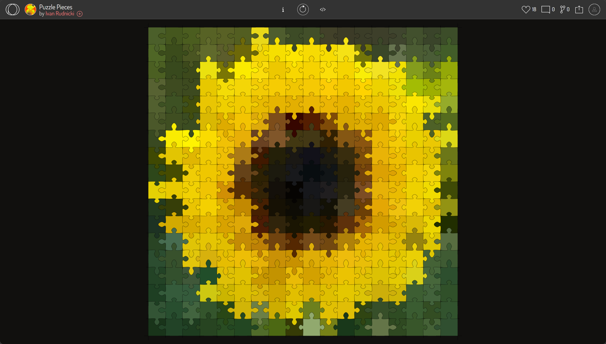

# haxu0278_9103_Som
My first repository for IDEA9103

This is my first local change to the repo!

May 1st: p5_project_Monalisa

May 8th: Quiz8
Part 1: Imaging Technique Inspiration
Chosen Example: Ivan Rudnicki's "Puzzle Pieces".
I chose this interactive puzzle artwork because of its playful logic. The image is broken into scattered pieces. What I really love is the interaction: when you click a piece, it usually snaps to its correct position, but there's also a small probability it will fly off randomly. You can even click on already assembled pieces to detach them. I want to incorporate this specific "snap-and-detach" mechanic and this slight unpredictability into my project. It transforms static visual data into a game-like experience, making it much more engaging to interact with.

![Puzzle State: Disassembled and Scattered] (WEEK9_QUIZ/PARTLY ASSEMBLED.png)

Part 2: Coding Technique Summary
To achieve this effect, I need to explore object-oriented programming combined with probability. Each puzzle piece acts as an independent object with specific states (like "scattered" or "assembled"). The core coding technique involves using mouse click events to trigger a probability check (like a random number generator). Based on that generated number, the code updates the object's target coordinates—either telling it to move to its "correct" grid location or fly to a random spot. Learning this logic of mixing user input with randomized outcomes is exactly what I need.
